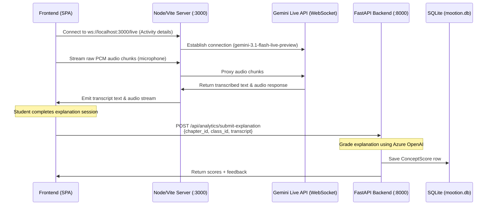

# Mootion Student Conceptual Analytics & STT Guide

This guide explains the architecture of the Speech-to-Text (STT) layer, how student verbal explanations are captured and saved, how analytics are calculated, and how to test these components end-to-end.

---

## 1. 🎙️ Speech-to-Text (STT) & Transcript Flow

The verbal interaction in Mootion utilizes a multi-tiered STT and proxy model:



### Key Components:
1. **Audio Streaming**: Audio is recorded in the browser and sent over WebSockets `/live` to the Node.js/Vite server (`server.ts`).
2. **Gemini Live API**: Transcribes and processes speech in real-time, returning transcripts which are accumulated on the frontend.
3. **Grading & Storage**: Once the student finishes speaking, the frontend submits the accumulated transcript to `POST /api/analytics/submit-explanation`. The backend grades it using Azure OpenAI and saves it as a `ConceptScore` record.

---

## 2. 📊 How the Analytics Layer Works

The analytics system provides insights for both students (their progress over time) and teachers (class performance and identifying struggling students).

### 1. Student Analytics Trend (`GET /api/analytics/student/{student_id}/scores`)
- Scores for the student are fetched and grouped by `chapter_id`.
- The system calculates the performance trend:
  - **Improving**: Overall score increased by $> 0.5$ between the first and last attempts.
  - **Declining**: Overall score decreased by $> 0.5$ between the first and last attempts.
  - **Stable**: Overall score difference is within $\pm 0.5$.

### 2. Class Overview for Teachers (`GET /api/analytics/class/{class_id}/overview`)
- Aggregates all concept scores for the class.
- Groups scores by `chapter_id` and calculates:
  - **Average Score**: Overall class mean score for the chapter.
  - **Student Count**: Number of unique students who attempted the chapter.
  - **Weakest Students**: Top 3 students with the lowest average score in that chapter (includes student ID, name, and score).

---

## 3. 🧪 Step-by-Step Testing Guide

To test the backend endpoints end-to-end, you can use the interactive **Swagger UI** or **curl**.

### Step 1: Open Swagger UI
Navigate to **[http://localhost:8000/docs](http://localhost:8000/docs)** in your browser. You will see the new `analytics` endpoints group.

### Step 2: Authenticate (Get JWT Tokens)
Before testing, you need authentication tokens (JSON Web Tokens).

#### 1. Student Login (Get Student Token)
Under `auth` group in Swagger, expand `POST /auth/login` (or use curl) to log in as a student.
- *Default Student seeded credentials*: Use the credentials of a student user (or log in as `abc`/`abc` teacher and check database classroom IDs).
- Copy the returned `access_token`.
- Click the **"Authorize"** button at the top right of Swagger UI, type `Bearer <your_student_token>`, and click Authorize.

---

### Step 3: Test Route 1 — Submit an Explanation
- Endpoint: `POST /api/analytics/submit-explanation`
- Body example:
  ```json
  {
    "chapter_id": "8cebb50b-b149-41d1-8329-22f97208fda7",
    "class_id": "e367f530-a63e-4caa-8942-105fad01378d",
    "transcript": "Cell division is when one cell splits into two cells so that the body can grow. This splits the DNA and splits the organelles between the cells."
  }
  ```
- Click **Execute**. The backend will:
  - Increment the student's attempt number for this chapter.
  - Query Azure OpenAI to grade the transcript.
  - Save it to the database and return the scores (clarity, accuracy, depth, overall) and LLM feedback.

---

### Step 4: Test Route 2 — Fetch Student Scores (Trend)
- Endpoint: `GET /api/analytics/student/{student_id}/scores`
- Parameters:
  - `student_id`: The UUID of the student you logged in as (or another student if logged in as a teacher).
- Click **Execute**. It returns their history grouped by chapter, including individual attempt numbers and computed trend.

---

### Step 5: Test Route 3 — Fetch Class Overview (Teacher view)
- Authorize Swagger UI with a **Teacher Token** (log in using `abc`/`abc` in `POST /auth/login`).
- Endpoint: `GET /api/analytics/class/{class_id}/overview`
- Parameters:
  - `class_id`: The UUID of the classroom.
- Click **Execute**. It returns class averages per chapter, student counts, and lists the top 3 weakest students.
