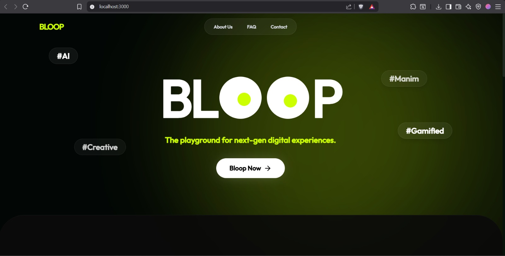
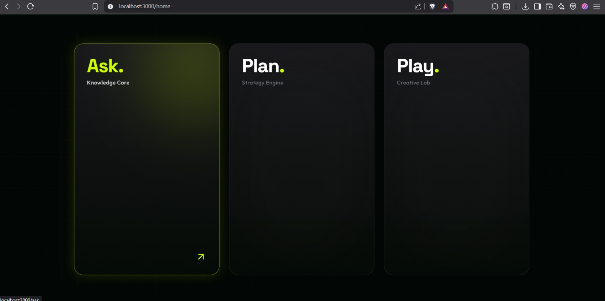
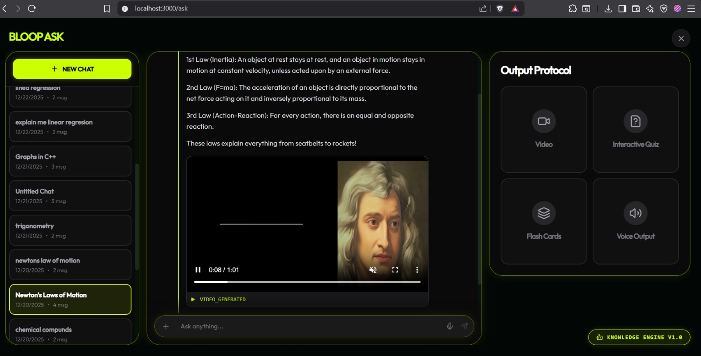
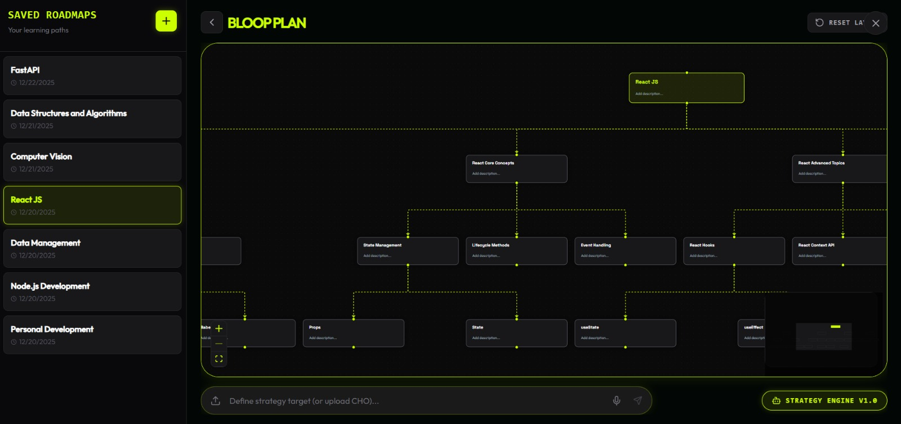
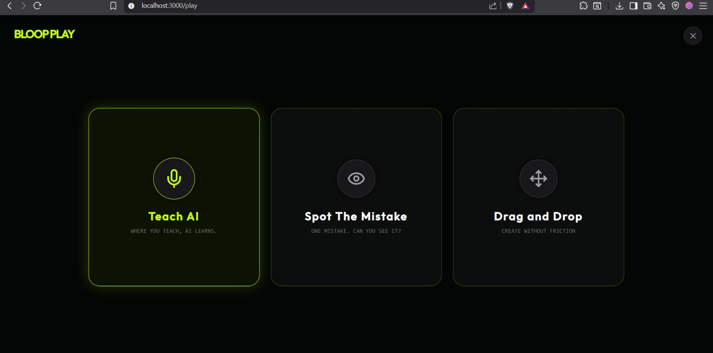
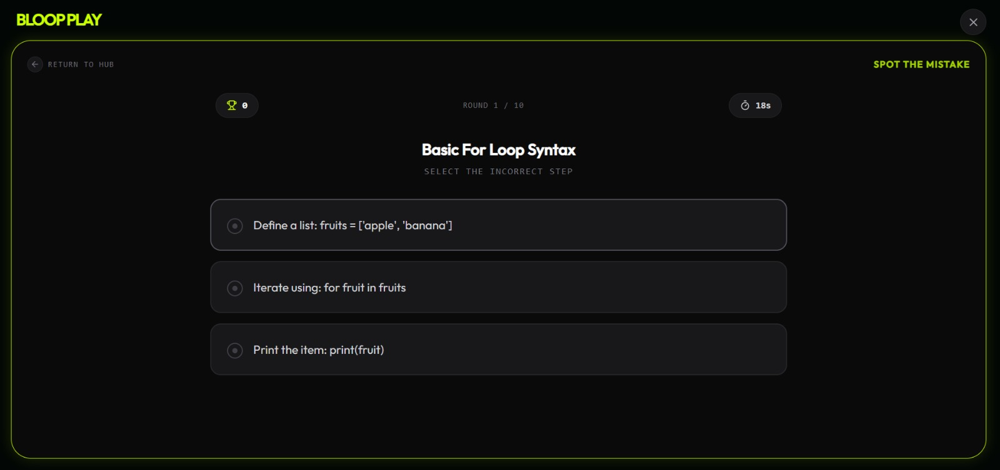
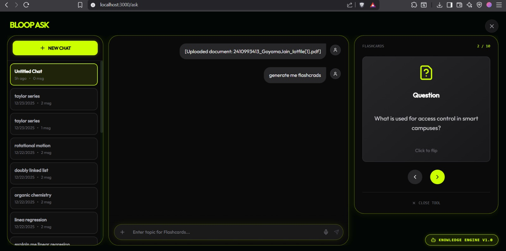
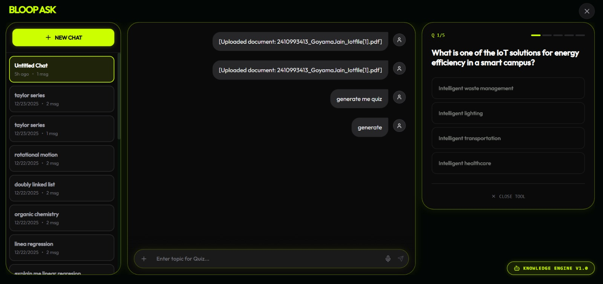

<div align="center">

# Bloop

**AI-Powered Educational Learning Platform**

Transform any concept into comprehensive learning experiences with AI-powered videos, personalized roadmaps, and interactive games.

[](https://opensource.org/licenses/MIT)
[](https://fastapi.tiangolo.com/)
[](https://www.manim.community/)
[](https://www.python.org/)
[](https://ffmpeg.org/)



</div>

---

## Overview

Bloop is a revolutionary AI-powered educational platform that transforms the way learners engage with complex concepts. Unlike traditional educational AI systems that produce static text or slides, Bloop creates **dynamic visual explanations** with synchronized narration and optional photorealistic talking avatars—all generated on-demand without precomputed assets.

The platform operates through three distinct modes: **ASK** for instant answers and content generation, **PLAN** for personalized learning roadmaps, and **PLAY** for gamified knowledge reinforcement. Whether you're a student, educator, corporate trainer, or content creator, Bloop provides a comprehensive ecosystem for learning that adapts to your unique needs and pace.

At its core, Bloop leverages cutting-edge AI technologies including Large Language Models for intelligent orchestration, Manim for programmatic animation generation, neural text-to-speech for studio-quality narration, and SadTalker for photorealistic talking avatars. The result is a seamless pipeline that converts simple text queries into production-quality educational videos in minutes.



---

## Key Features

- 🎨 **Programmatic Animation Engine** — Create stunning Manim animations automatically from educational concepts
- 🎙️ **Scene-Aligned Narration** — Neural TTS with perfect temporal synchronization to every visual element
- 🤖 **Talking Avatar Integration** — Photorealistic avatars using SadTalker for human-like delivery
- 🧠 **LLM-Orchestrated Pipeline** — Intelligent scene planning and automated error repair for flawless rendering
- 🎯 **Fault-Tolerant Rendering** — Scene-isolated execution with graceful degradation ensures reliability
- 📚 **Document-Based Learning** — Generate videos, flashcards, and quizzes from PDFs, textbooks, or research papers
- 🗺️ **Personalized Roadmaps** — AI-generated learning paths tailored to your level and schedule
- 🎮 **Interactive Learning Games** — Three engaging games with voice interaction for active reinforcement

---

## Demo Gallery

### Full Pipeline Demo

<video src="bloop-core/assets/gifs/final_video.mp4" controls width="100%"></video>

*Complete educational video with Manim animation and SadTalker avatar in production quality*

### Manim Animation Engine

<video src="bloop-core/assets/gifs/manim_video.mp4" controls width="100%"></video>

*Real-time generation of mathematical visualizations with LaTeX rendering*

### Talking Avatar (SadTalker)

<video src="bloop-core/assets/gifs/avatar_generation.mp4" controls width="100%"></video>

*Photorealistic avatar with synchronized lip movements and natural expressions*

### ASK Mode — Chat & Q&A



*Intelligent document Q&A with context-aware responses and citations*

### PLAN Mode — Learning Roadmap



*AI-generated personalized learning paths with milestones and resources*

### PLAY Mode — Interactive Games

<table>
  <tr>
    <td align="center"></td>
    <td align="center"></td>
  </tr>
  <tr>
    <td align="center"><em>Games Overview</em></td>
    <td align="center"><em>Individual Game View</em></td>
  </tr>
</table>

*Engaging educational games: Teach the AI, Drag & Drop, Identify the Error*

### Flashcard Generation



*Automatic flashcard generation from documents with spaced repetition*

### Quiz Generation



*Intelligent quiz creation with multiple question types and adaptive difficulty*

---

## Architecture

```
                                    ┌─────────────────────┐
                                    │     Client Query    │
                                    └──────────┬──────────┘
                                               │
                                               ▼
                              ┌──────────────────────────────┐
                              │     bloop-core (FastAPI)     │
                              │         Port 8000            │
                              │                              │
                              │  ┌────────────────────────┐  │
                              │  │   LLM Orchestration    │  │
                              │  │  • Scene Planning     │  │
                              │  │  • Answer Generation  │  │
                              │  │  • Error Repair       │  │
                              │  └───────────┬────────────┘  │
                              └──────────────┼──────────────┘
                                             │
                        ┌────────────────────┴────────────────────┐
                        │                                         │
                        ▼                                         ▼
              ┌─────────────────────┐               ┌─────────────────────┐
              │ animation-engine    │               │   React Frontend    │
              │    (Manim API)       │               │    Port 3000        │
              │    Port 8001         │               │                     │
              │                      │               │  • ASK Mode UI      │
              │  ┌────────────────┐  │               │  • PLAN Mode UI     │
              │  │ Scene Planning │  │               │  • PLAY Mode UI     │
              │  │  (LLM → JSON)  │  │               └─────────────────────┘
              │  └───────┬────────┘  │
              │          │           │
              │          ▼           │
              │  ┌────────────────┐  │
              │  │  Manim Engine  │  │
              │  │  • Rendering   │  │
              │  │  • Error Catch │  │
              │  │  • Auto Repair │  │
              │  └───────┬────────┘  │
              │          │           │
              │          ▼           │
              │  ┌────────────────┐  │
              │  │     TTS Gen    │  │
              │  │  (Azure/Eleven)│  │
              │  └───────┬────────┘  │
              │          │           │
              │          ▼           │
              │  ┌────────────────┐  │
              │  │   FFmpeg       │  │
              │  │  • Sync        │  │
              │  │  • Stitch      │  │
              │  └───────┬────────┘  │
              │          │           │
              │          ▼           │
              │  ┌────────────────┐  │
              │  │  SadTalker     │  │
              │  │  • Avatar Gen  │  │
              │  │  • Lip Sync    │  │
              │  │  • Compositing │  │
              │  └────────────────┘  │
              └─────────────────────┘
```

---

## Repository Structure

```
bloop-v0/
│
├── bloop-core/                  # Main application
│   ├── backend/                  # FastAPI backend (Port 8000)
│   │   ├── main.py
│   │   ├── api/
│   │   ├── services/
│   │   └── venv/
│   │
│   ├── frontend/                 # React frontend (Port 3000)
│   │   ├── src/
│   │   ├── public/
│   │   └── package.json
│   │
│   ├── ai_models/               # AI model weights
│   │   └── SadTalker/
│   │
│   └── assets/
│       ├── images/               # Static images
│       └── gifs/                 # Demo videos
│
└── animation-engine/             # Standalone Manim microservice (Port 8001)
    ├── app/
    │   ├── routes/
    │   ├── services/
    │   └── utils/
    ├── venv/
    └── requirements.txt
```

---

## Quick Start

### Running bloop-core

```bash
# Navigate to backend directory
cd bloop-core/backend

# Create and activate virtual environment
python -m venv venv
source venv/bin/activate  # Windows: venv\Scripts\activate

# Install dependencies
pip install -r requirements.txt

# Install Manim
pip install manim

# Install system dependencies (Linux/macOS)
sudo apt-get install ffmpeg        # or `brew install ffmpeg` on macOS
sudo apt-get install libcairo2-dev pkg-config python3-dev

# Set up environment variables
cp .env.example .env
# Edit .env with your API keys

# Start the backend server (Port 8000)
uvicorn main:app --reload --host 0.0.0.0 --port 8000

# In a new terminal, start the frontend (Port 3000)
cd bloop-core/frontend
npm install
npm run dev
```

### Running animation-engine

```bash
# Navigate to animation-engine directory
cd animation-engine

# Create and activate virtual environment
python -m venv venv
source venv/bin/activate

# Install dependencies
pip install -r requirements.txt

# Set up environment variables
cp .env.example .env

# Start the Manim API server (Port 8001)
uvicorn app.main:app --reload --host 0.0.0.0 --port 8001
```

### Environment Variables

| Variable | Description | Required |
|----------|-------------|----------|
| `OPENAI_API_KEY` | OpenAI API key for GPT-4 | Yes |
| `AZURE_OPENAI_ENDPOINT` | Azure OpenAI endpoint (optional) | No |
| `AZURE_SPEECH_KEY` | Azure Speech API key for TTS | Yes |
| `AZURE_SPEECH_REGION` | Azure region (e.g., eastus) | Yes |
| `TTS_PROVIDER` | TTS provider: azure or elevenlabs | Yes |
| `SADTALKER_MODEL_PATH` | Path to SadTalker model weights | No |
| `ENABLE_AVATAR` | Enable SadTalker avatar generation | No |
| `UPLOAD_DIR` | Directory for uploaded files | No |
| `OUTPUT_DIR` | Directory for generated content | No |
| `MAX_SCENE_RETRIES` | Max retry attempts for failed scenes | No |
| `SCENE_TIMEOUT` | Timeout per scene in seconds | No |

---

## The Three Modes

### ASK — Intelligent Learning Assistant

Get instant answers, generate videos, flashcards, and quizzes from any document.

**Sub-features:**
- 📹 **Video Generation** — AI creates animated explainer videos with synchronized narration
- 💬 **Document Q&A** — Chat with your documents, get cited answers
- 🃏 **Flashcard Generation** — Auto-extract key concepts with spaced repetition
- 📝 **Quiz Generation** — Multiple question types with adaptive difficulty

---

### PLAN — Personalized Roadmap Generation

Create structured learning paths tailored to your goals and schedule.

**Sub-features:**
- 🗺️ **Dynamic Roadmaps** — AI generates milestone-based learning paths
- 📊 **Progress Tracking** — Monitor your advancement through the curriculum
- 🔄 **Adaptive Pacing** — Roadmap adjusts based on your performance
- 📚 **Resource Recommendations** — Curated videos, articles, and exercises

---

### PLAY — Gamified Learning Reinforcement

Reinforce knowledge through interactive, voice-enabled games.

**Sub-features:**
- 🗣️ **Teach the AI** — Explain concepts via voice, get real-time feedback
- 🎯 **Drag & Drop Challenge** — Match concepts visually
- ⚠️ **Identify the Error** — Spot misconceptions in statements

---

## Tech Stack

| Component | Technology | Purpose |
|-----------|-------------|---------|
| **Backend Framework** | FastAPI 0.109.0 | High-performance async API |
| **Frontend** | React + TypeScript | Modern SPA with Vite |
| **LLM Orchestration** | GPT-4 / Azure OpenAI | Scene planning, Q&A, generation |
| **Animation Engine** | Manim Community | Programmatic video rendering |
| **Text-to-Speech** | Azure TTS / ElevenLabs | Neural narration synthesis |
| **Video Processing** | FFmpeg | Audio-video synchronization & stitching |
| **Avatar Generation** | SadTalker | Photorealistic talking avatars |
| **Document Processing** | PyPDF2, python-docx | Content extraction and analysis |
| **Real-time Updates** | WebSockets | Live progress streaming |
| **Voice Recognition** | Whisper / Azure Speech | Voice-to-voice game mode |

---

## Performance Benchmarks

### ASK Mode Generation Times

| Content Type | Processing Time | Quality |
|--------------|-----------------|---------|
| Video (30 seconds) | 15–30s | High |
| Video (1 minute) | 45–90s | High |
| Video (2 minutes) | 2–3 min | High |
| Flashcards (20 cards) | 10–15s | High |
| Quiz (10 questions) | 15–20s | High |
| Document Q&A | < 5s | High |

### PLAN Mode Generation Times

| Input Type | Complexity | Processing Time |
|------------|------------|-----------------|
| Document | Basic (4 weeks) | 20–30s |
| Document | Intermediate (12 weeks) | 40–60s |
| Topic description | Advanced (24 weeks) | 60–90s |

### PLAY Mode Response Times

| Game Type | Response Time | Interaction Mode |
|-----------|---------------|------------------|
| Teach the AI | Real-time | Voice-to-voice |
| Drag & Drop | Instant | Interactive UI |
| Identify Error | Instant | Multiple choice |

---

## Use Cases

### 🎓 Education & E-Learning
- Self-paced learning with complete content-to-games ecosystem
- Exam preparation with videos, flashcards, and quizzes
- STEM education with physics simulations and math visualizations
- Language learning with grammar exercises

### 🏢 Corporate Training
- Employee onboarding with custom learning paths
- Technical training with video tutorials and validation games
- Compliance training with interactive quizzes
- Product knowledge with visual demonstrations

### 🔬 Academic Research
- Paper comprehension with summaries and Q&A
- Concept mastery through video explanations
- Study planning from research papers
- Peer teaching validation

### 🎨 Content Creators
- Rapid course development
- Student engagement through games
- Animated tutorial creation
- Multi-format content generation

---

## FAQ

**Q: How long does video generation take?**
> Video generation takes 45–90 seconds for a 2-minute video. Flashcards and quizzes generate in 10–20 seconds. Roadmaps take around 20–60 seconds depending on complexity.

**Q: Can I use my own avatar image?**
> Yes! Upload any portrait image and Bloop will animate it with synchronized lip movements using SadTalker.

**Q: What's the difference between the three modes?**
> ASK mode helps you understand content (videos, flashcards, Q&A). PLAN mode creates personalized learning roadmaps. PLAY mode reinforces learning through interactive games.

**Q: Can I customize the learning roadmap?**
> Yes, specify your level (beginner/intermediate/advanced), desired duration, focus areas, and weekly time commitment. The roadmap adapts to your progress.

**Q: Do the games track my progress?**
> Yes, all three games track performance, provide feedback, and adapt difficulty based on your responses.

**Q: What document formats are supported?**
> PDF, DOCX, TXT, and plain text input are all supported for content generation.

---

## License

This project is licensed under the **MIT License**. See the [LICENSE](LICENSE) file for details.

---

## Acknowledgments

- **OpenAI** — For GPT-4 and foundational AI capabilities
- **Azure** — For TTS and cloud infrastructure
- **Manim Community** — For the extraordinary animation framework
- **SadTalker Team** — For pioneering avatar generation technology

---

## Support & Community

- 📖 **Documentation**: [Bloop Docs](https://chartreuse-vest-a4b.notion.site/Bloop-2d9dbad1b5d380ecb859dd25b9e4acf3)
- 🐛 **GitHub Issues**: [Report bugs or request features](https://github.com/rachitgoyal14/bloop/issues)
- 📧 **Email**: rachitgoyal14@gmail.com

---

<div align="center">

### Ready to transform education?

[Get Started](#quick-start) · [View Docs](https://chartreuse-vest-a4b.notion.site/Bloop-2d9dbad1b5d380ecb859dd25b9e4acf3)

</div>
