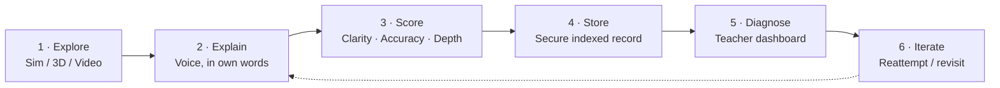
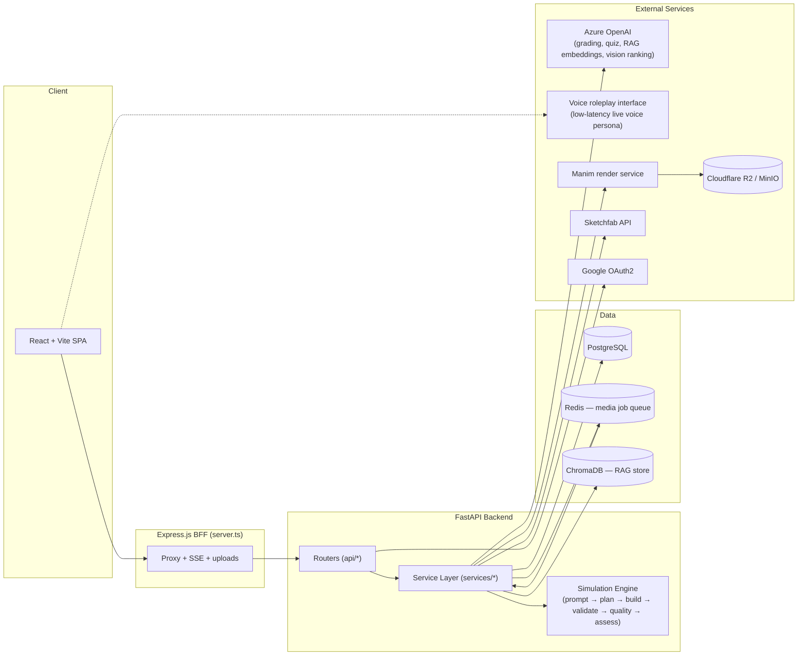

# Mootion

> **Turning student interactions into actionable understanding signals for teachers.**

**Team Evolve AI** · Wadhwani AI SahAI Hackathon — Phase 2 Evaluation · Status: 🚧 Active pilot development

Mootion is a conceptual-understanding diagnostic engine for NCERT classrooms (Grades 6–12). Students explain concepts out loud in their own words; an AI scoring pipeline turns those explanations into a structured understanding signal; teachers get a zero-effort dashboard telling them exactly which students are stuck, on what, and why — before the exam, not after.

---

## Table of Contents

- [The Problem](#the-problem)
- [The Solution](#the-solution)
- [The Diagnostic Loop](#the-diagnostic-loop)
- [Core Features](#core-features)
- [Architecture](#architecture)
- [Tech Stack](#tech-stack)
- [Repository Structure](#repository-structure)
- [API Surface](#api-surface)
- [Getting Started](#getting-started)
- [Evaluation & Pilot Results](#evaluation--pilot-results)
- [Responsible AI & Privacy](#responsible-ai--privacy)
- [Known Limitations & Tech Debt](#known-limitations--tech-debt)
- [Roadmap](#roadmap)
- [Team](#team)
- [Acknowledgments](#acknowledgments)

---

## The Problem

India has solved school enrollment — it has not solved learning.

| Metric | Value |
|---|---|
| Children aged 6–14 enrolled in school | 98% |
| Grade 5 students who cannot read a basic Grade 2 text | 50% |
| Average score in Grade 9 mathematics nationwide | 37% |
| Students who can apply percentages to real scenarios | 29% |
| Overall graduate employability (cited cause: systemic rote learning) | 42.6% |

Structurally, teachers are on their own: **1.04 lakh single-teacher schools** operate daily in India, student–teacher ratios of **1:40–1:50** are common, and over **30% of rural teachers** lose 15–20 hours a month to non-teaching paperwork. Any tool that adds even a minute of extra work to that routine gets rejected — insight has to be generated automatically, not entered manually.

**Persona — Meera, 34, Science Teacher, Grades 8–10:** manages 45 students per class across 6 periods a day, but can only meaningfully probe ~4 students per class. 41 students remain conceptually invisible to her, every single day.

> *"I know some of them don't understand. I just don't know which ones, or why."* — Meera

Existing tools all fail the same way: video libraries (YouTube) are one-way with no feedback loop; discovery sandboxes (PhET) let students explore but have no validation checkpoint; MCQ systems only test recall and are easily gamed; direct AI chatbots are single-student assistants with zero cohort-level insight for the teacher.

## The Solution

Mootion is intentionally **not** a chatbot, a content library, or an isolated simulation platform. It's a **conceptual understanding signal engine** built around a closed teacher–student diagnostic loop, anchored in the **Feynman Technique**: you only truly understand something when you can explain it simply, in your own words, to someone else.

Students "teach" an AI persona styled as a curious child. Forcing an explanation strips away memorized textbook jargon and isolates real comprehension from rote recall — every explanation becomes a piece of actionable signal for the teacher, with **zero extra grading work** on her end.

This also completes a portfolio gap. Reading fluency and spoken English already have linear, scalable measurement (words-correct-per-minute, pronunciation accuracy). Conceptual understanding never had an equivalent signal — that's the gap Mootion is built to fill.

## The Diagnostic Loop



Each step exists because the one before it is meaningless without it — a student can't explain what they haven't explored; an explanation without scoring is just talk; a score without storage is forgotten; storage without a teacher-facing map is useless; and a real diagnostic is a cycle, not a one-shot event.

**Real example:** a student attempted the *Cell Division* module three times over 48 hours. Initial Depth score: 3/10 (pure regurgitation of the mitosis definition). After review and iterative re-explanation: 3 → 5 → 7. The teacher spent zero minutes grading; the loop completed the recovery cycle on its own.

## Core Features

### Student experience
- **Explain It** — multilingual "Teach the AI" Feynman-style explanation capture
- **Predict–Observe–Explain** — operational reasoning via simulation outcome prediction
- **Spot the Misconception / Spot It** — surface-recall identification within a visual model
- **Concept Sort / Connect It** — relational understanding checks
- **Doubt rescue loop** — student gets stuck mid-explanation → submits a doubt (with optional prior-attempt context) → gets a clarification response without breaking flow or needing the teacher directly
- **Playground** — on-demand 3D models (Sketchfab-sourced), interactive simulations, and AI-generated concept videos for free exploration
- **Chat with AI tutor** — agentic assistant with slash commands (`/video`, `/universe`, `/quiz`, `/simulation`) that plans and executes tool calls per message

### Teacher experience
- **Onboard & map** — pick school, grade, subject; NCERT curriculum auto-bootstraps
- **Run exit activity** — projector-mode class-wide explanation activity replacing manual quizzes
- **Diagnose the morning after** — dashboard surfaces a class understanding map, misconception clusters, and a short list of students who need a revisit
- **Cohort clustering** — KMeans-based grouping (Struggling / Average / Strong) with a suggested action per cohort, instead of a single useless class average
- **Doubt inbox** — view, respond to, and resolve student doubts; AI-drafted responses can be approved or overridden
- **Content library** — adopt already-generated assets (videos, sims, 3D models) across classes instead of regenerating from scratch

### Four generation pillars
1. **Video** — Manim-rendered concept animations
2. **Simulation** — interactive HTML5 sims (PhET-style embeds + a custom multi-phase generation pipeline)
3. **3D models** — Sketchfab search, ranked by an LLM vision pass for educational relevance
4. **Quiz / assessment** — short LLM-generated MCQ sets per chapter or topic

## Architecture



**Notes on the diagram:**
- The Express BFF (`server.ts`) sits in front of the FastAPI backend, transforming/combining some calls and hosting the SSE endpoints used for real-time playground voice sessions.
- Heavy generation (video, simulation, 3D, quiz) for **assignments** goes through an async Redis-backed job queue and worker; **direct** teacher/chat-triggered generation currently runs synchronously inside the request handler (see [Known Limitations](#known-limitations--tech-debt)).
- Two distinct LLM touchpoints exist: a **text/vision pipeline on Azure OpenAI** (grading, quiz generation, RAG-grounded answers, 3D-model ranking) and a **live voice roleplay interface** for the curious-AI-persona explanation sessions — keep these straight when debugging, since they have different latency and failure characteristics.

## Tech Stack

| Layer | Technology |
|---|---|
| Frontend | React, Vite, TypeScript |
| BFF | Express.js (`server.ts`) — proxying, SSE, file uploads, static serving |
| Backend API | FastAPI (Python), Pydantic schemas |
| ORM / DB | SQLAlchemy, PostgreSQL |
| Auth | JWT (access + refresh, rotation on refresh), Google OAuth2 |
| Job queue | Redis (list-based queue, `SET NX` dedup, stale-job recovery) |
| Vector store / RAG | ChromaDB, Azure OpenAI `text-embedding-3-small` |
| LLM (text/vision) | Azure OpenAI — grading, quiz generation, doubt-topic extraction, 3D-model ranking |
| LLM (voice) | Live voice roleplay interface for the "teach the AI" persona |
| Video generation | Self-hosted Manim rendering service |
| 3D content | Sketchfab API |
| Object storage | Cloudflare R2 (prod) / MinIO (local dev) via a unified boto3-based wrapper |
| Clustering | scikit-learn (KMeans, k=3) |

## Repository Structure

> Reconstructed from a codebase audit — verify paths against the actual repo before relying on them.

```
backend/
  app/
    api/                  # FastAPI routers: auth, teachers, students, curriculum,
                           # chapters, assignments, student_assignments, chat_ai,
                           # simulation, analytics, library, media, health
    core/                 # config, security, deps (auth guards), models (ORM), storage
    schemas/              # Pydantic request/response models, grouped by domain
    services/              # business logic: onboarding, curriculum, chapter,
                           # assignment, media_worker/media_queue/media_service,
                           # model_finder, student_actions, chat_ai, rag,
                           # library, clustering
    simulation_engine/    # prompt understanding → planning → build →
                           # scientific validation → UI quality → assessment

frontend/
  src/
    pages/                # Teacher*, Student*, Landing/Onboarding pages
    components/           # ChatbotFab, LiveVoiceActivity, ProtectedRoute, etc.
    data/                 # NCERT syllabus presets + mock/fallback data
    lib/api.ts             # shared fetch wrapper (auth-refresh, error handling)
  server.ts               # Express BFF
```

## API Surface

Selected router prefixes — see your full endpoint inventory for line-level detail.

| Prefix | Covers |
|---|---|
| `/auth` | register, login, refresh, logout, Google OAuth, `/auth/me` |
| `/teachers` | profile, onboarding, classes, doubts, analytics |
| `/students` | profile, onboarding, doubts, quotas, playground, classes/chapters |
| `/teachers/classes/{class_id}/curriculum` | curriculum CRUD, NCERT bootstrap (single + bulk), versioned patching |
| `/teachers/classes/{class_id}/chapters` | chapter bootstrap, listing, asset/topic-asset generation |
| `/teachers/classes/{class_id}/assignments` | assignment creation + async job tracking |
| `/students/classes/{class_id}/assignments` | student assignment view + submission/grading |
| `/chat-with-ai` | AI tutor chat threads + agentic tool-calling messages |
| `/simulations` | spec/prompt-based simulation generation, resolution, HTML render |
| `/media` | signed/redirect access to generated assets |
| `/teachers/library` | cross-class asset discovery and adoption |
| `/api/analytics` | explanation scoring, score trends, class overview, clustering |

> ⚠️ `/api/analytics` is currently the only router mounted under an `/api/` prefix — everything else mounts directly (`/auth`, `/teachers`, …). Worth normalizing before this grows further.

## Getting Started

> Commands below assume a standard FastAPI + Vite layout — adjust entrypoints/scripts to match what's actually in `backend/` and `frontend/`.

### Prerequisites
- Python 3.11+, Node 18+
- PostgreSQL, Redis
- An Azure OpenAI resource with chat, embedding, and vision-capable deployments
- A Sketchfab API token
- Cloudflare R2 credentials (or a local MinIO container) for media storage
- (Optional) Google OAuth client credentials for social login

### Backend
```bash
cd backend
python -m venv .venv && source .venv/bin/activate
pip install -r requirements.txt

cp .env.example .env       # fill in the variables listed below

uvicorn app.main:app --reload --port 8000
```

In a separate process, start the async media worker (handles assignment-triggered video/simulation/3D/quiz generation):
```bash
python -m app.services.media_worker
```

### Frontend
```bash
cd frontend
npm install
npm run dev
```

### Key environment variables

| Variable | Purpose |
|---|---|
| `JWT_SECRET` | Signs access/refresh tokens — **must** be overridden in any non-local environment; there is no runtime check forcing this |
| `DATABASE_URL` | PostgreSQL connection string |
| `REDIS_URL` | Media generation job queue |
| `AZURE_OPENAI_ENDPOINT` / `AZURE_OPENAI_API_KEY` | Grading, quiz generation, embeddings, vision ranking |
| `MANIM_SERVICE_URL` | Self-hosted video rendering service |
| `SKETCHFAB_API_URL` / token | 3D model search |
| `OBJECT_STORAGE_*` → `R2_*` → `MINIO_*` | Object storage, checked in that fallback order; default bucket `mootion-media` |
| `GOOGLE_OAUTH_CLIENT_ID` / `GOOGLE_OAUTH_CLIENT_SECRET` | Google sign-in (optional) |

## Evaluation & Pilot Results

A held-out evaluation of the LLM scoring pipeline against trained human educators, run over **47 real student explanation transcripts** across 6 Biology/Physics NCERT topics (Photosynthesis, Cell Osmosis, Newton's Third Law, spindle separation, among others):

| Scoring dimension | LLM vs. human agreement | Cohen's κ |
|---|---|---|
| Accuracy (fact-check) | 81% | 0.74 (strong) |
| Structural Clarity | 78% | 0.71 (strong) |
| Reasoning Depth | 74% | 0.68 (moderate) |

In 11 of 13 teacher-flagged cases, the LLM's feedback correctly isolated the exact misconception. These are **preliminary results from 12 pilot sessions**; the validation trial is expanding toward a 100+ fully annotated transcript benchmark.

**Field pilot (1-week trial, Grade 9 science):**
- 10 of 12 students completed the unprompted voice-explanation sequence end to end.
- Several low-Depth students self-identified their own gaps unprompted ("I didn't really know the why").
- 4 students naturally code-switched into Hindi mid-explanation; the pipeline scored reasoning accurately regardless.

> *"I have never seen something like this in an ed-tech tool before. For the first time, I actually know exactly which students don't understand the lesson before they write the exam."* — Grade 9 science teacher, pilot participant

Post-pilot adaptations shipped in response: a browser-native Web Speech fallback for unreliable rural connectivity, teacher onboarding cut from 6 steps to 3, and average processing latency cut from 8.0s to 3.2s.

**Projected unit economics** (blended, at 1,000 active students/day): ~$73/day total (≈₹6,100/day), or **≈₹6.10 per student per day** — combining voice explanation scoring, simulation rendering, and video compilation costs.

## Responsible AI & Privacy

- **Teacher-in-the-loop, always:** the AI suggests signals; the teacher is the final authority on any action taken. No automated punitive assessment.
- **Multilingual parity:** explanations are scored in Hindi, Punjabi, Tamil, Telugu, and English — language choice does not penalize depth scoring.
- **Anti-surveillance data policy:** diagnostics are private, local instructional-unblocking metrics for the teacher — not institutional metrics for ranking or targeting schools.
- **Data minimization:** voice audio is downsampled, processed locally where possible, and purged from edge nodes within 24 hours; only anonymized, aggregated metrics are written to long-term storage.
- **No silent score sharing:** scores are not shared with parents or administration without teacher verification.
- **Explainability:** every score is paired with a short, plain-language feedback paragraph, not a bare number.
- **Low-end device support:** designed to run as a lightweight PWA on ~₹8,000 Android devices, with self-contained simulations to reduce bandwidth dependency.

## Known Limitations & Tech Debt

Surfaced by an internal codebase audit — flagged here deliberately so they don't get rediscovered the hard way. Severity is relative to product correctness, not necessarily security exposure.

| Severity | Area | Issue |
|---|---|---|
| 🔴 | Doubt clarification video | The doubt-flow Manim call uses a **10-second** timeout vs. 300s elsewhere, so it almost always times out and falls back to a hardcoded placeholder stock video instead of an AI-generated explanation. |
| 🔴 | Analytics | Two parallel, unintegrated analytics systems exist side by side: a 0–3 scale (`StudentAttempt`-based) and a 0–10 scale (`ConceptScore`-based), on different endpoints, with no shared source of truth. Some analytics-drill endpoints also return **hardcoded mock fields** (e.g. a fixed streak value, a fixed prediction-accuracy value) as if they were live data. |
| 🔴 | Curriculum bootstrap | The "bulk" NCERT bootstrap endpoint **destructively deletes** all existing chapters/curricula for a class with no confirmation step — used as a frontend fallback when no curriculum is detected. |
| 🔴 | Doubt gating | The "attempt before you ask" product rule (`tried_before`) is captured on submission but never actually enforced server-side. |
| ⚠️ | Auth | A handful of endpoints (a media redirect route, several simulation read routes) have no auth check at all; the JWT secret defaults to an insecure placeholder with no runtime enforcement of a real value in production. |
| ⚠️ | Frontend/backend mismatch | Some student-facing pages call teacher-only chapter endpoints directly — these will 403 against a real student token. |
| ⚠️ | Reliability | The media worker is single-process/single-threaded with no retry or backoff on failed jobs; a Redis enqueue failure during assignment creation is currently swallowed silently. |
| ⚠️ | Subject-specific prompts | Grading and quiz-generation prompts currently hardcode "science teacher" framing, which doesn't fit Mathematics or Computer Science content. |
| ⚠️ | Duplicated playground simulation/voice logic | `LiveVoiceActivity` and parts of the student playground page appear to implement overlapping session/connect/audio flows independently, bypassing the shared API client's auth-refresh handling. |

This list isn't exhaustive — treat it as a starting checklist before the next pilot phase rather than a complete inventory.

## Roadmap

| Target | Initiative | Owner | Success metric |
|---|---|---|---|
| Q3 2026 | **Sync Projector Broadcast** — mirror collective exit activities on local blackboards with real-time class data processing | Rachit Goyal (Systems Architect) | Sub-100ms dashboard latency |
| Q4 2026 | **Metacognitive Prediction** — calibration models mapping the gap between student confidence and accuracy | Goyam Jain (Lead ML) | 90% accuracy in failure alerts |
| Q1 2027 | **Regional SSC Board Sync** — broaden NCERT parsing to absorb state-board variations, starting with Maharashtra | Sartaj Kaur (Product Lead) | 3 board ingests in under 30 days |

## Team

**Evolve AI** — a multi-disciplinary cohort bridging fast, clean technical pipelines with deep pedagogic goals.

| | Name | Role | Focus |
|---|---|---|---|
| SK | Sartaj Kaur | Product Lead | Product strategy, field loops & pedagogic goals |
| RG | Rachit Goyal | Systems Architect | Backend orchestration and persistent storage grids |
| PG | Poorvika Grover | Design Lead | Unified design system and student experience routes |
| GJ | Goyam Jain | Lead ML Engineer | Model alignment & voice optimization engines |
| DC | Divyansh Chawla | Lead Backend | WebSocket proxy pipelines & FastAPI endpoints |

## Acknowledgments

Built for the **Wadhwani AI SahAI Hackathon — Phase 2 Evaluation**, in partnership with **Wadhwani AI** and **Reskill.ai**.

---

*"The enrollment problem has been solved. The understanding problem now officially has a real-time signal."*
